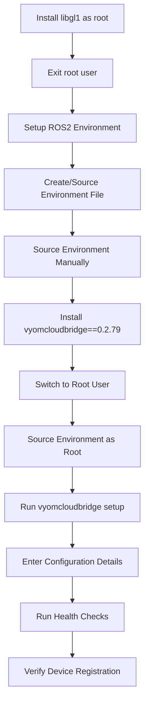

# Vyom Cloud Bridge Setup Guide

This comprehensive guide covers the complete setup process for Vyom Cloud Bridge with ROS2 integration, following the exact specifications provided.

## 1. System Prerequisites and Dependencies

### Install API Dependencies (as root user)
```bash
sudo apt install libgl1
```
**Purpose**: This package is required for ROS2 image encoding functionality.

### Exit Root User
After installing system dependencies, exit the root user and continue with regular user account.

## 2. ROS2 Setup and Environment Configuration

### ROS2 Installation (System-wide)
ROS2 should be installed as a prerequisite. If not installed, follow the official guide:
- **Installation Guide**: https://docs.ros.org/en/humble/Installation/Ubuntu-Install-Debs.html

**Verify ROS2 Installation**:
```bash
ros2 node list
```

### Environment Setup (Non-root user)
Create and source an environment file that includes:
- ROS2 Humble
- Python virtual environment (venv) 
- Other required packages

**Example environment file** (`/home/username/.bashrc`):
```bash
# Source ROS2 Humble
source /opt/ros/humble/setup.bash

# Activate Python virtual environment (if created)
# source /path/to/your/venv/bin/activate

# Export any additional environment variables
```

**Important Notes**:
- Keep this environment file handy for sourcing
- Remember the username that will be used for ROS2 communication (ROS2 is user-sensitive)
- This file can be `.bashrc` and should source ROS2 environment + venv if created

## 3. Vyom Cloud Bridge Installation

### Installation Options
Install vyomcloudbridge either:
- **Recommended**: At venv level in user profile
- **Alternative**: At venv/system level in sudo user profile

### Manual Environment Sourcing
```bash
# Source the environment file manually for first time
source /home/username/.bashrc
# or source your custom environment file
```

### Install Vyom Cloud Bridge
```bash
pip install vyomcloudbridge==0.2.79
```

**  Installation Warnings**:
- May override existing pip packages to higher versions
- May re-install custom pymavlink installations (as it's a dependency)

## 4. Vyom Cloud Bridge Setup Configuration

### Switch to Root User
```bash
sudo su
```

### Source Environment File as Root
```bash
# Manually source the environment file as root user
source /home/username/.bashrc
# or source your custom environment file
```

### Run Setup Command
```bash
vyomcloudbridge setup
```

**Enter the following configuration details when prompted**:
- **Organization ID**: `1`
- **Machine UID**: `88882` 
- **Machine Name**: `Machine 88882`
- **Machine Model ID**: `2`

## 5. Health Checks and Verification

### Check Library Health
```bash
vyomcloudbridge health
```
**Purpose**: 
- Verify library installation
- Check if setup is completed properly
- Validate system configuration

### Verify Device Registration
- The same machine ID (`88882`) should appear on HQ under device list
- Check the web dashboard to confirm successful registration

### Check Background Services
```bash
vyomcloudbridge list --all
```
**Purpose**: Display all running background services related to Vyom Cloud Bridge

### Monitor Machine Statistics
Check detailed machine information including:
- Machine buffer status
- Other machine details
- Storage information

**Location**: Navigate to `S3 > buckets > vyomos > [machine_id]`

## 6. Important Technical Notes

### ROS Integration Behavior
- **Automatic Skip**: ROS-related steps will automatically skip if ROS2 is not properly configured
- **User Sensitivity**: ROS2 communication is user-sensitive, maintain consistency in user accounts

### Environment Management
- **Consistency Required**: Always source the same environment file across different contexts
- **User Context Switching**: Properly handle environment sourcing when switching between regular user and root
- **File Location**: Environment file can be `.bashrc` or custom script location

### Installation Dependencies
- **libgl1**: Specifically required for ROS2 image encoding (apt install libgl1)
- **pymavlink**: May be reinstalled during vyomcloudbridge installation
- **Version Locking**: Use exact version 0.2.79 for compatibility

## 7. Setup Flow Summary



## 8. Troubleshooting Guide

### Common Issues and Solutions

**ROS2 Not Found**:
```bash
# Check ROS2 installation
ros2 node list
# If fails, reinstall ROS2 following official guide
```

**Environment Sourcing Issues**:
```bash
# Verify environment file exists and has correct permissions
ls -la /home/username/.bashrc
# Check ROS2 sourcing
source /opt/ros/humble/setup.bash
```

**Permission Issues**:
- Ensure proper user context switching between regular user and root
- Verify environment file is accessible from both user contexts

**Health Check Failures**:
```bash
# Run detailed health check
vyomcloudbridge health
# Check background services
vyomcloudbridge list --all
```

This setup guide maintains all the specific technical details, configuration values, and behavioral notes from the original specifications while organizing them into a clear, executable format.